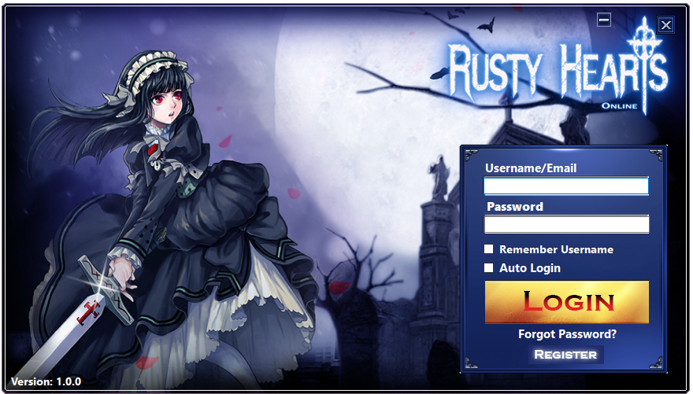
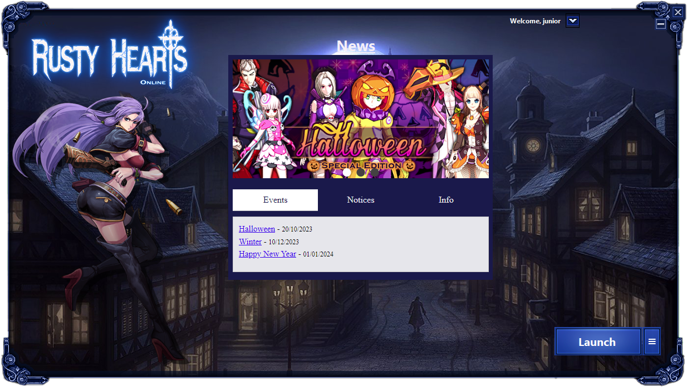
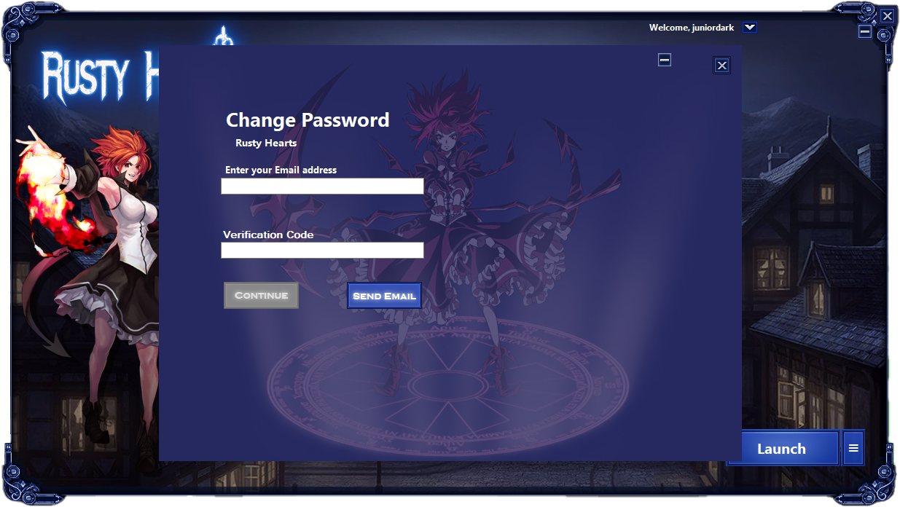

# Rusty Hearts Launcher

## Introduction
Rusty Hearts Launcher is a custom launcher for the Rusty Hearts game client. It provides several features, including self-updating, automatic game updates, account registration, and a news window.

## Table of Contents
* [Features](#features)
* [Setup](#setup)
* [Prerequisites for Building Locally/Development](#prerequisites-for-building-locallydevelopment)
* [System Requirements for Ready-to-use build](#system-requirements-for-ready-to-use-build)
* [Preview](#preview)
* [License](#license)
* [Contributing](#contributing)
* [FAQ](#faq)
* [Credits](#credits)
* [Support](#support)
* [Roadmap](#roadmap)

## Features
* Self-updating: The launcher can automatically update itself to the latest version.
* Automatic game update: The launcher can automatically download and install updates.
* Register account: Users can register a new account/change the password directly from the launcher.
* News window: The launcher displays the latest news and updates about the game.

## Setup
The launcher require the [Rusty Hearts API](https://github.com/JuniorDark/RustyHearts-API) to work. See the api documentation for instructions on setup.

### API URL

In order for the launcher to work it need to be conected to the api. To change the URL address of the launcher API open the config.ini (it will be created when opening the launcher for the first time).

The default URL for the api can be changed on IniFile.cs

### Client region
The client region can be set on Service on config.ini 

* **usa** (PWE) - Full api support
* **chn** (Xunlei) - Only launcher support

### Launcher self-update

In order for the launcher to automatically update itself, you need to use the launcher_info.ini in the `launcher_update` directory of the api. This file specifies the version of the launcher. After each update of the launcher, you need to change the version in the ini, as well in the launcher executable file.

### Client patch

In order to create client patches, you need to use the `patch` directory of the api.

The tool for creating the patch files is available in the repository: https://github.com/JuniorDark/RustyHearts-MIPTool

### Launcher customization
If you want to change the text on the launcher the strings can be found on LocalizedStrings.resx resource file.

If you want to change the text on the buttons/images used in the launcher you can use the Photoshop .psd files included in the Resources.rar

## Prerequisites for Building Locally/Development
The launcher is built in .NET 7 and as such, the packages listed below are required to create a local and development build of the launcher. Furthermore, it uses many submodules and packages outside of this, which will automatically be loaded when the user sets up a local environment of the application.
* Visual Studio 2022 (Any Edition - 17.4 or later)
* Windows 10 SDK (10.0.19043.0) or Windows 11 SDK (10.0.22000.0) via Visual Studio Installer
* .NET: [.NET Core 7 SDK (7.0.100 or later)](https://dotnet.microsoft.com/en-us/download/dotnet/7.0)

## System Requirements for Ready-to-use build
* OS: Windows 10 1809 Update (build 17763) or later / Windows 11 (Any builds)
* Architecture: x64/AMD64

## Preview

## License
This project is licensed under the terms found in [`LICENSE-0BSD`](LICENSE).

## Contributing
Contributions from the community are welcome! If you encounter a bug or have a feature request, please submit an issue on GitHub. If you would like to contribute code, please fork the repository and submit a pull request.

## FAQ
* Q: How do I report a bug?
  * A: Please submit an issue on GitHub with a detailed description of the bug and steps to reproduce it.
* Q: How do I request a new feature?
  * A: Please submit an issue on GitHub with a detailed description of the feature and why it would be useful.
* Q: How do I contribute code?
  * A: Please fork the repository, make your changes, and submit a pull request.

## Credits
The following third-party libraries, tools, and resources are used in this project:
* [Microsoft.Web.WebView2](https://www.nuget.org/packages/Microsoft.Web.WebView2)
* [Newtonsoft.Json](https://www.nuget.org/packages/Newtonsoft.Json)

## Support
If you need help with the launcher, please submit an issue on GitHub.

## Roadmap
* Add support for client download/repair
* Improve performance and stability
* Add support for additional languages
